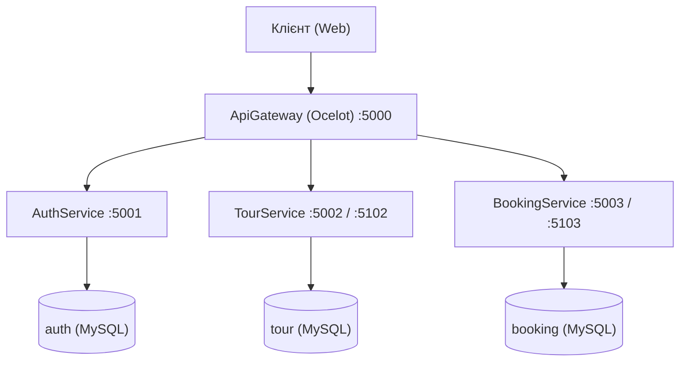
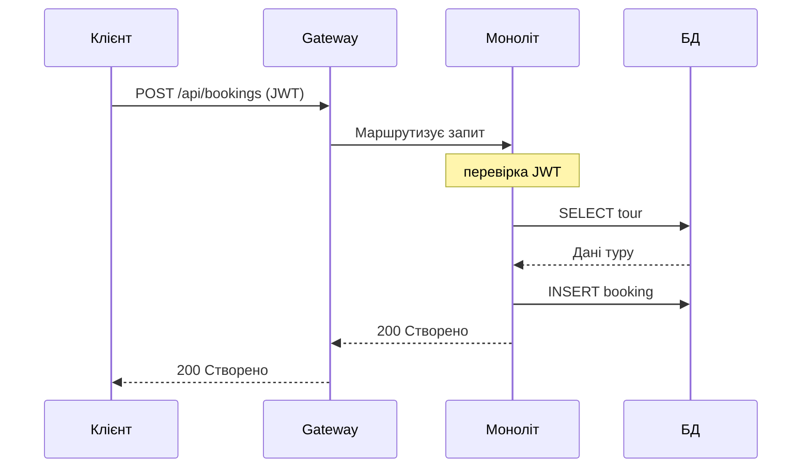
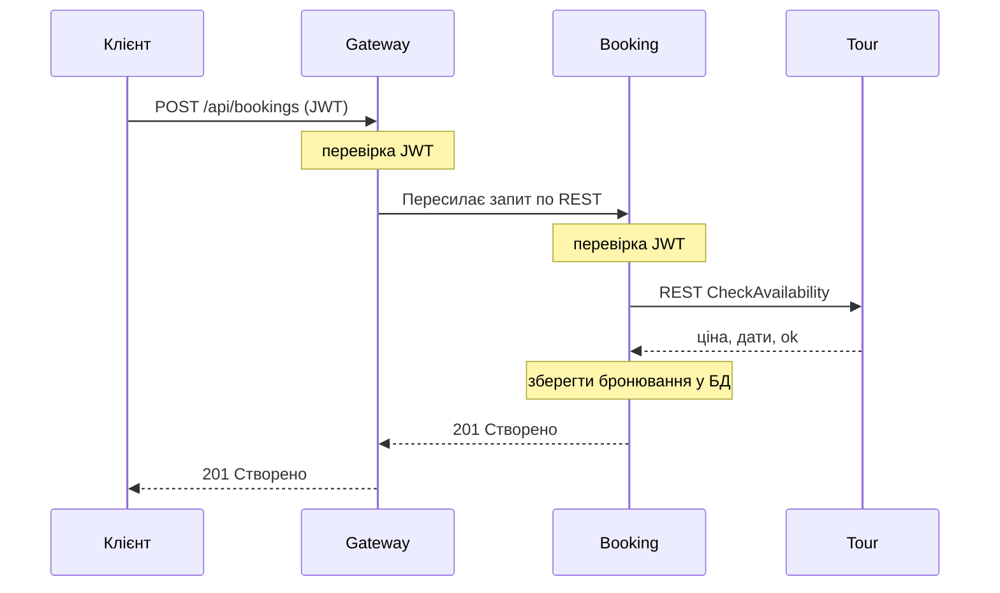

# Діаграма композиції

```mermaid
graph TD
    Client["Клієнт (Web)"]
    Gateway["ApiGateway (Ocelot) :5000"]
    
    AuthS["AuthService :5001"]
    TourS["TourService :5002 / :5102"]
    BookS["BookingService :5003 / :5103"]
    
    AuthDB[("auth (MySQL)")]
    TourDB[("tour (MySQL)")]
    BookDB[("booking (MySQL)")]
    
    Client --> Gateway
    Gateway --> AuthS
    Gateway --> TourS
    Gateway --> BookS
    
    AuthS --> AuthDB
    TourS --> TourDB
    BookS --> BookDB
```

## Монолітна архітектура

```mermaid
sequenceDiagram
    participant Client as Клієнт
    participant Gateway as Gateway
    participant Monolith as Моноліт
    participant DB as БД

    Client->>Gateway: POST /api/bookings (JWT)
    Gateway->>Monolith: Маршрутизує запит

    Note over Monolith: перевірка JWT

    Monolith->>DB: SELECT tour
    DB-->>Monolith: Дані туру

    Monolith->>DB: INSERT booking

    Monolith-->>Gateway: 200 Створено
    Gateway-->>Client: 200 Створено
```

## Мікросервісна архітектура

```mermaid
sequenceDiagram
    participant Client as Клієнт
    participant Gateway as Gateway
    participant BookingS as Booking
    participant TourS as Tour

    Client->>Gateway: POST /api/bookings (JWT)

    Note over Gateway: перевірка JWT

    Gateway->>BookingS: Пересилає запит по REST

    Note over BookingS: перевірка JWT

    BookingS->>TourS: REST CheckAvailability
    TourS-->>BookingS: ціна, дати, ok

    Note over BookingS: зберегти бронювання у БД

    BookingS-->>Gateway: 201 Створено
    Gateway-->>Client: 201 Створено
```
