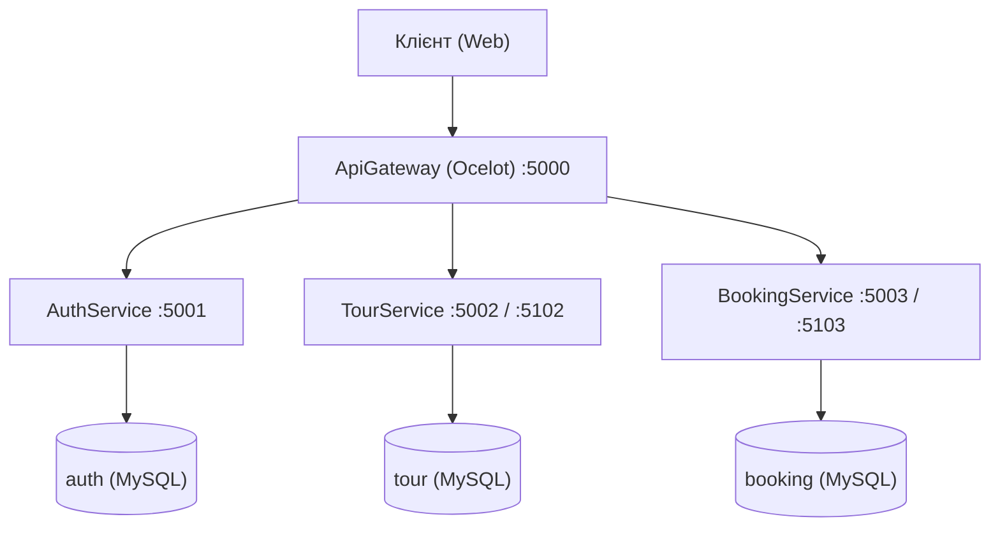
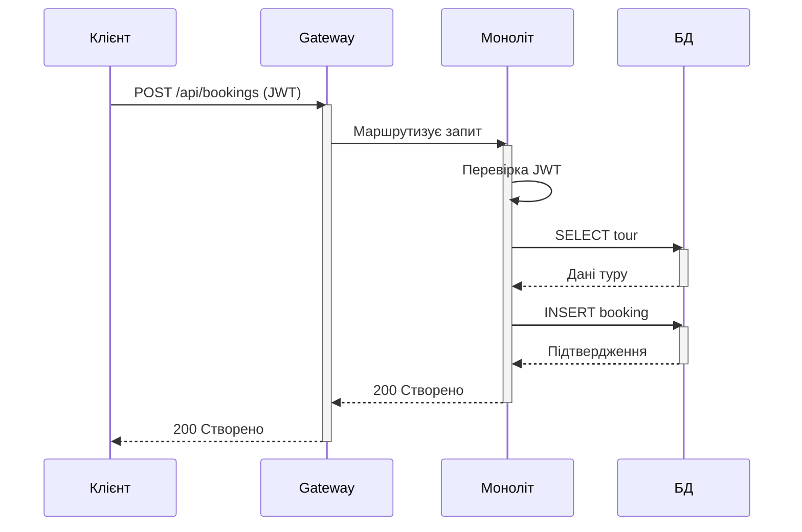
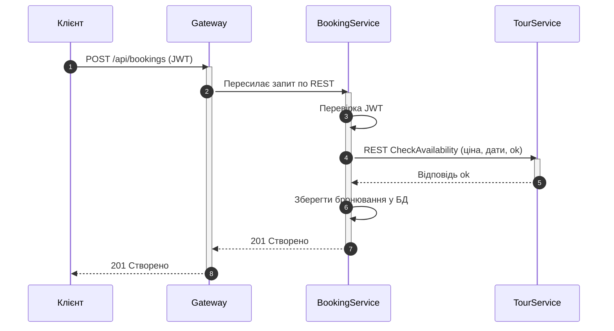

# Діаграма композиції

```mermaid
graph TD
    Client["Клієнт (Web)"]
    Gateway["ApiGateway (Ocelot) :5000"]
    
    AuthS["AuthService :5001"]
    TourS["TourService :5002 / :5102"]
    BookS["BookingService :5003 / :5103"]
    
    AuthDB[("auth (MySQL)")]
    TourDB[("tour (MySQL)")]
    BookDB[("booking (MySQL)")]
    
    Client --> Gateway
    Gateway --> AuthS
    Gateway --> TourS
    Gateway --> BookS
    
    AuthS --> AuthDB
    TourS --> TourDB
    BookS --> BookDB
```

# Діаграма послідовності — монолітна архітектура

```mermaid
sequenceDiagram
    participant Client as Клієнт
    participant Gateway as Gateway
    participant Monolith as Моноліт
    participant DB as БД

    Client->>Gateway: POST /api/bookings (JWT)
    activate Gateway

    Gateway->>Monolith: Маршрутизує запит
    activate Monolith
    
    Monolith->>Monolith: Перевірка JWT
    
    Monolith->>DB: SELECT tour
    activate DB
    DB-->>Monolith: Дані туру
    deactivate DB
    
    Monolith->>DB: INSERT booking
    activate DB
    DB-->>Monolith: Підтвердження
    deactivate DB
    
    Monolith-->>Gateway: 200 Створено
    deactivate Monolith
    
    Gateway-->>Client: 200 Створено
    deactivate Gateway
```

# Діаграма послідовності — мікросервісна архітектура

```mermaid
sequenceDiagram
    autonumber
    
    participant Client as Клієнт
    participant Gateway as Gateway
    participant BookingS as BookingService
    participant TourS as TourService

    Client->>Gateway: POST /api/bookings (JWT)
    activate Gateway
    
    Gateway->>BookingS: Пересилає запит по REST
    activate BookingS
    
    BookingS->>BookingS: Перевірка JWT
    
    BookingS->>TourS: REST CheckAvailability (ціна, дати, ok)
    activate TourS
    
    TourS-->>BookingS: Відповідь ok
    deactivate TourS
    
    BookingS->>BookingS: Зберегти бронювання у БД
    
    BookingS-->>Gateway: 201 Створено
    deactivate BookingS
    
    Gateway-->>Client: 201 Створено
    deactivate Gateway
```
